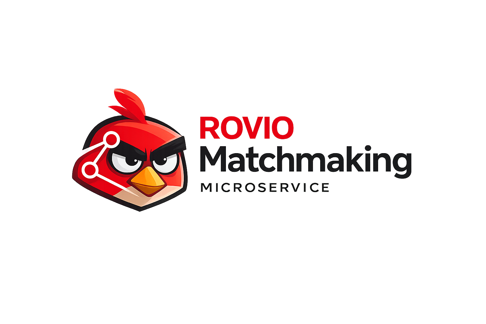
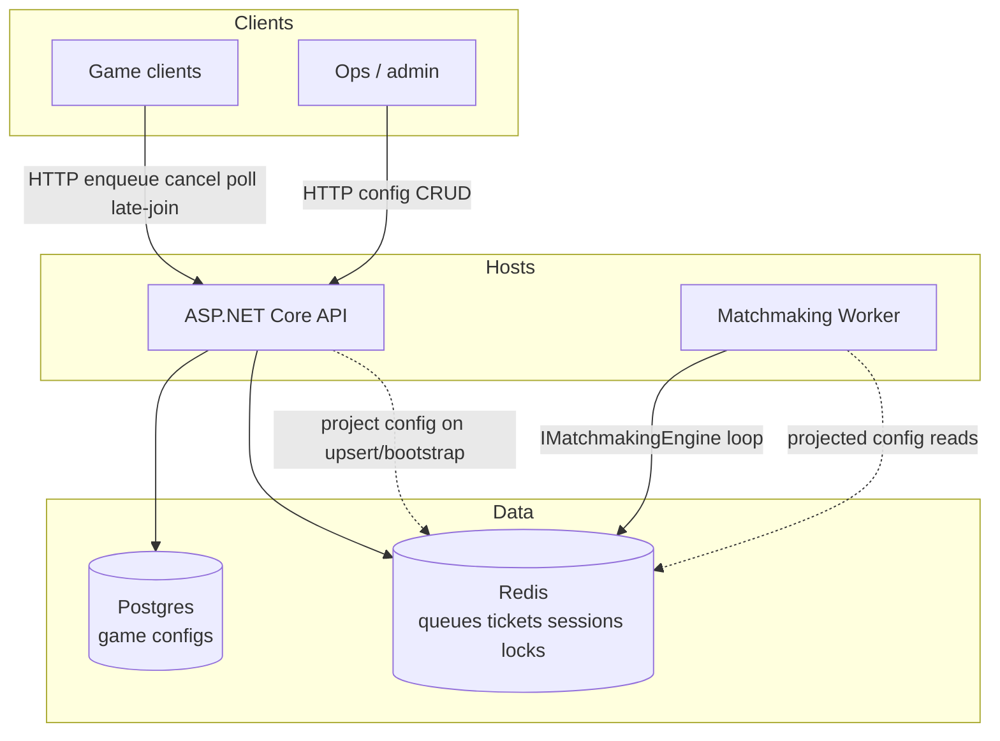
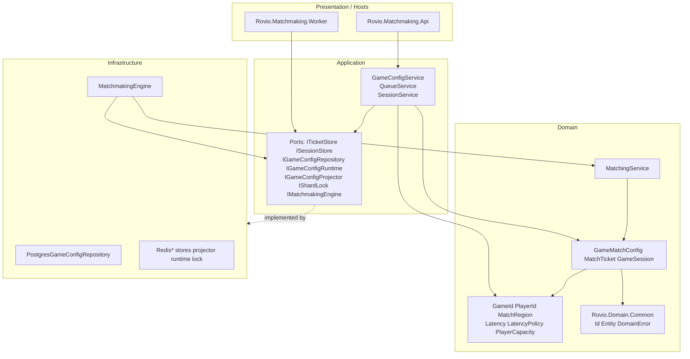
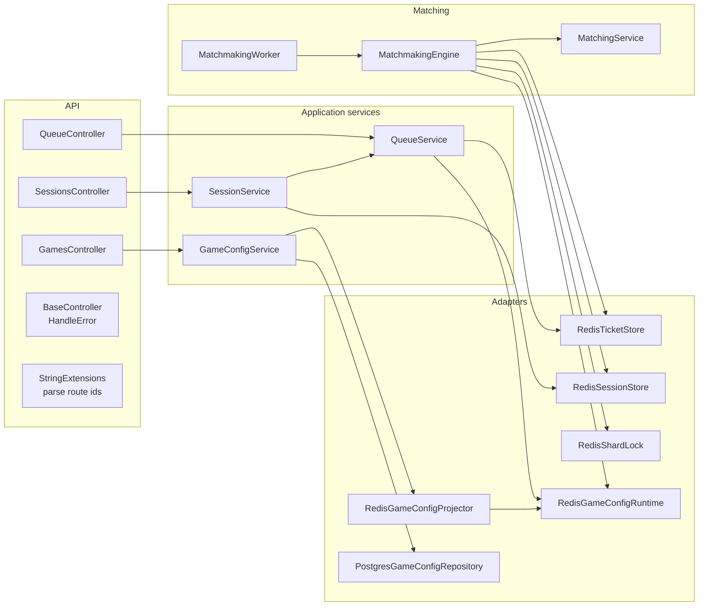
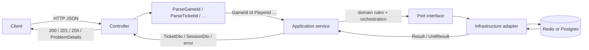
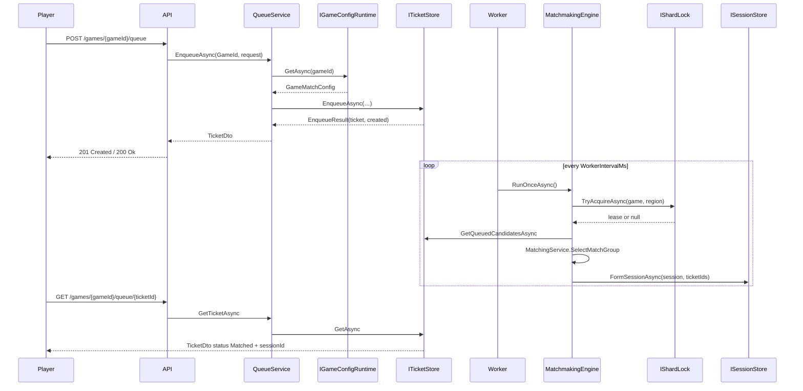
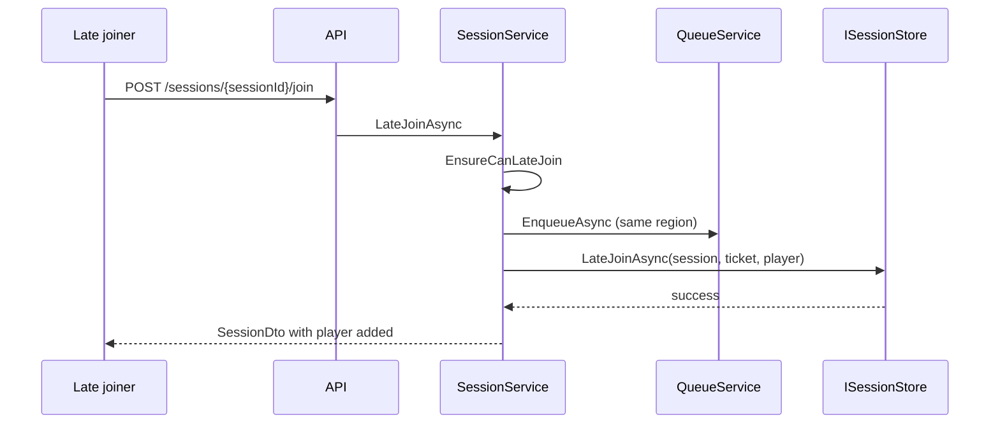
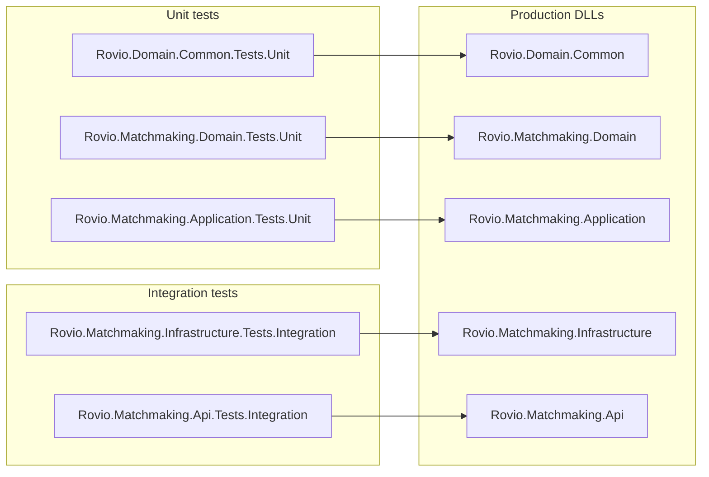
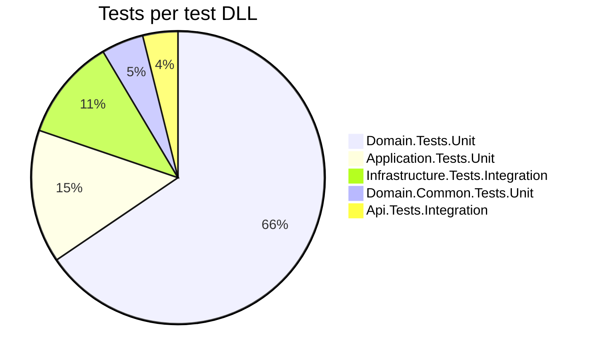

# Rovio Matchmaking microservice - Architecture & Design Documentation

> A production-shaped,  **DDD-inspired** matchmaking microservice for Angry Birds 2-style multi-game queues: durable config in Postgres, hot-path state in Redis, and a dedicated Worker that forms sessions asynchronously.

This document captures the **patterns**, **best practices**, **architectural decisions** and **endpoint usages** applied in the solution, with diagrams for the whole system. Layer-specific detail lives next to the code - see [Layer documentation](#layer-documentation).

> Before having a look to this document: start with [Before reading the source code](docs/before-reading-the-source.md). It explains why the solution is deliberately production-shaped, how to approach the codebase, and the suggested reading order, so this longer architecture guide is easier to navigate. 
---

## Table of Contents

- [Features](#features)
- [High-level diagram](#high-level-diagram)
- [Entire architecture diagram](#entire-architecture-diagram)
- [Components diagram](#components-diagram)
- [Request diagram](#request-diagram)
- [Sequence diagrams (late join included)](#sequence-diagrams)
- [Clean Architecture overview](#clean-architecture-overview)
- [Applied Domain-Driven Design Patterns](#applied-domain-driven-design-principles-and-patterns)
- [Applied Design principles and patterns](#applied-design-principles-and-patterns)
- [Architectural decisions](#architectural-decisions)
- [Best practices applied](#best-practices-applied)
- [Technologies used](#technologies-used)
- [Deploying to Kubernetes](#kubernetes-deployment)
- [Project structure](#project-structure)
- [Layer documentation](#layer-documentation)
- [Getting started (How to run?)](#getting-started)
- [Testing philosophy](#testing)
- [Failure model](#failure-model)
- [How to call endpoints?](#rovio-matchmaking-microservice-endpoints)
- [AI usage](#ai-usage)
---

## Features

- **Multi-game queueing** - players enqueue by `gameId` / region / latency; tickets are idempotent per player.
- **Latency + wait-time matching** - no skill rating; compatibility expands with time in queue via `LatencyPolicy`.
- **Late join** - open sessions can accept additional players when config allows.
- **Admin-ready config** - CRUD in Postgres, projected to Redis for the hot path (no in-process config cache).
- **Independent Worker** - matching runs on a timer outside the API so HTTP stays request/response-fast.
- **Explicit failures** - Domain/Application return `Result` / `UnitResult`; API maps to Problem Details (including 429 / 503).

---

## High-level diagram

How the system looks from the outside: clients talk to the API; the Worker forms matches in the background; both share Redis for runtime state and Postgres for durable game rules.



For how this design scales toward tens of millions of concurrent players (component diagram, roles, alternatives), see **[scaling-10m-players.md](docs/scaling-10m-players.md)**.

---

## Entire architecture diagram

Dependency rule: outer layers depend inward. Infrastructure and hosts adapt to Application ports; Domain has no outward dependencies on Redis, Postgres, or HTTP.



---

## Components diagram

Major building blocks and how they collaborate at runtime.



---

## Request diagram

Typical player request path: HTTP → parse identity → application service → port → Redis/Postgres → `Result` → Problem Details or DTO.



**Admin config write path** adds a projection step: Postgres upsert → `IGameConfigProjector` → Redis config keys, so enqueue and the Worker never read Postgres on the hot path.

---

## Sequence diagrams

### Enqueue → match → poll



### Late join



---

## Clean Architecture overview

| Layer | Project | Responsibility |
|-------|---------|----------------|
| **Domain** | `Rovio.Matchmaking.Domain` (+ `Rovio.Domain.Common`) | Entities, value objects, domain service (`MatchingService`), invariants via `Result` factories |
| **Application** | `Rovio.Matchmaking.Application` | Use cases (`*Service`), ports (`Abstractions`), DTOs/requests, options |
| **Infrastructure** | `Rovio.Matchmaking.Infrastructure` | EF Core / Postgres, Redis adapters + Lua, `MatchmakingEngine` |
| **API** | `Rovio.Matchmaking.Api` | REST, Problem Details, health, bootstrap migrations/seed/project |
| **Worker** | `Rovio.Matchmaking.Worker` | Hosted loop calling `IMatchmakingEngine` |

Dependencies point **inward**. Application never references Infrastructure; Infrastructure implements Application ports.

---

## Applied Domain-Driven Design Patterns

1. **Bounded context** - Matchmaking owns queues, tickets, sessions, and game matchmaking policy; not combat, economy, or auth.
2. **Ubiquitous language** - `GameMatchConfig`, `MatchTicket`, `GameSession`, `MatchRegion`, `LatencyPolicy`, late join, shard.
3. **Entities** - `GameMatchConfig`, `MatchTicket`, `GameSession` with identity (`Id<T>`) and lifecycle.
4. **Value objects** - `GameId`, `PlayerId`, `MatchRegion`, `Latency`, `LatencyDelta`, `LatencyPolicy`, `PlayerCapacity` — validated at creation, immutable.
5. **Domain service** - `MatchingService` selects compatible ticket groups using config policy (logic that does not belong on a single entity).
6. **Application services** - `QueueService`, `SessionService`, `GameConfigService` orchestrate use cases without owning business invariants.
7. **Repositories / ports** - durable config via `IGameConfigRepository`; runtime via Redis-backed ports (`ITicketStore`, `ISessionStore`, …).
8. **Factories** - domain `Create` / `CreateQueued` / `CreateAngryBirds2Defaults`; test factories in `Rovio.Matchmaking.Tests.Data`.
9. **Shared kernel** - `Rovio.Domain.Common` (`Id<T>`, `Entity<T>`, `DomainError`, SmartEnum `ErrorType`).

This is **DDD-inspired / tactical DDD**, not a full strategic Event Storming + domain-events stack (no MediatR CQRS, no outbox domain events in this service).

[Here](docs/prompts/coding_standards/domain-layer-standards.md) I'm argueing why I picked Domain-driven Design(DDD) approach.

---

## Applied Design principles and patterns

1. Strategy pattern
2. Mediator pattern
3. Chain of Responsibility pattern
4. Dependency Injection pattern
5. Builder pattern
6. Singleton pattern
7. Adapter pattern
8. Facade pattern
8. Options pattern
8. Factory method pattern
8. Repository pattern

---

## Architectural decisions

| Decision | Rationale |
|----------|-----------|
| **Postgres for config, Redis for runtime** | Config needs durable admin CRUD and migrations; queues/tickets/sessions need low latency and atomic scripts. |
| **No in-process cache for match state** | Avoid split-brain across API/Worker replicas; Redis is the single runtime source of truth. |
| **Separate Worker host** | Matching is continuous and CPU/IO heavy; scale matchers independently of API replicas. |
| **Lua for commits, locks for leadership** | Lock prevents duplicate work; Lua prevents torn updates under races. |
| **Latency + queue wait, not skill** | Matches Angry Birds 2–style fair, time-relaxed matching. |
| **Application services** | Few use cases; explicit services keep the surface small and readable. |
| **Result over exceptions for domain/app errors** | Predictable API contracts and testable failure paths. |
| **Strong typing on ports** | Parse at HTTP edge (`StringExtensions`); Application/Infrastructure speak VOs/`Id<>`. |
| **Multi-game via `gameId` namespaces** | One service, many games, Redis key prefixes and Postgres rows keyed by game. |

---

## Best practices applied

- **Dependency inversion** - Application depends on abstractions; Infrastructure implements them.
- **Thin controllers** - parse → call service → map result; no business rules in API.
- **Composition root per host** - API and Worker each call `AddMatchmakingInfrastructure`.
- **Health checks** - `/health/live` vs `/health/ready` (Postgres + Redis).
- **Integration tests with Testcontainers** - real Postgres/Redis for Infrastructure and API IT.
- **Unit tests at Domain and Application** - pure rules and mocked ports.
- **Global usings** - reduce noise in Application/Infrastructure.
- **Layer READMEs** - short, diagram-backed docs next to code (linked below).
- **High cohesion inside modules** - each project/layer groups closely related responsibilities (e.g. Domain owns invariants; Application owns use cases).
- **Loose coupling between modules** - layers and ports communicate through abstractions, not concrete infrastructure types.
- **Single Responsibility principle** - controllers, application services, domain entities, and adapters each have one reason to change.
- **Open/Closed principle** - new store strategies or hosts can be added by implementing ports / composing DI without rewriting domain rules.
- **Liskov Substitution principle** - Infrastructure adapters are substitutable for their Application port contracts without breaking callers.
- **Interface Segregation principle** - focused ports (`ITicketStore`, `ISessionStore`, `IGameConfigRuntime`, …) instead of one wide infrastructure interface.
- **Design by contract** - domain factories and Application `Result` / `UnitResult` make preconditions and failure outcomes explicit.
- **Strong Composition and Domain-Driven Design** - Business behavior is encapsulated within entities, value objects, and domain services, while application hosts compose dependencies through DI instead of relying on inheritance-heavy frameworks.
- **Thoughtful Application of OOP Principles** - The system applies information hiding, encapsulation, abstraction, polymorphism, message passing, and reusability to produce cohesive, maintainable, and extensible code.
---

## Technologies used

### Runtime & language

| Technology | Version |
|------------|---------|
| **.NET** | **10.0** (`net10.0` across all projects) |
| **C#** | **14** (default language version for .NET 10 SDK) |
| **ASP.NET Core** | **10.0** (API host) |

### Production NuGet packages

| Package | Version | Used in |
|---------|---------|---------|
| `AspNetCore.HealthChecks.NpgSql` | 9.0.0 | Api |
| `AspNetCore.HealthChecks.Redis` | 9.0.0 | Api |
| `CSharpFunctionalExtensions` | 3.7.0 | Domain.Common, Domain, Application, Infrastructure, Api |
| `Microsoft.AspNetCore.OpenApi` | 10.0.8 | Api |
| `Microsoft.EntityFrameworkCore` | 10.0.10 | Infrastructure |
| `Microsoft.EntityFrameworkCore.Design` | 10.0.10 | Infrastructure, Api |
| `Microsoft.EntityFrameworkCore.Relational` | 10.0.10 | Infrastructure |
| `Microsoft.Extensions.DependencyInjection.Abstractions` | 10.0.10 | Infrastructure |
| `Microsoft.Extensions.Hosting` | 10.0.10 | Worker |
| `Microsoft.Extensions.Logging.Abstractions` | 10.0.10 | Infrastructure |
| `Microsoft.Extensions.Options` | 10.0.10 | Application |
| `Ardalis.SmartEnum` | 8.2.0 | Domain.Common, Domain |
| `Microsoft.Extensions.Options.ConfigurationExtensions` | 10.0.10 | Infrastructure |
| `Npgsql.EntityFrameworkCore.PostgreSQL` | 10.0.3 | Infrastructure |
| `StackExchange.Redis` | 3.0.17 | Infrastructure |

### Test NuGet packages

| Package | Version | Used in |
|---------|---------|---------|
| `coverlet.collector` | 6.0.4 | Unit / integration test projects |
| `CSharpFunctionalExtensions` | 3.7.0 | Domain / Application / Infrastructure test projects |
| `FluentAssertions` | 8.10.0 | Unit / integration test projects |
| `Microsoft.AspNetCore.Mvc.Testing` | 10.0.10 | Api.Tests.Integration |
| `Microsoft.EntityFrameworkCore.Relational` | 10.0.10 | Api / Infrastructure integration tests |
| `Microsoft.Extensions.Configuration` | 10.0.10 | Infrastructure.Tests.Integration |
| `Microsoft.Extensions.Configuration.Binder` | 10.0.10 | Infrastructure.Tests.Integration |
| `Microsoft.Extensions.DependencyInjection` | 10.0.10 | Infrastructure.Tests.Integration |
| `Microsoft.Extensions.Logging` | 10.0.10 | Infrastructure.Tests.Integration |
| `Microsoft.Extensions.Logging.Abstractions` | 10.0.10 | Infrastructure.Tests.Integration |
| `Microsoft.Extensions.Options` | 10.0.10 | Tests.Data, Application.Tests.Unit |
| `Microsoft.Extensions.Options.ConfigurationExtensions` | 10.0.10 | Infrastructure.Tests.Integration |
| `Microsoft.NET.Test.Sdk` | 17.14.1 | Unit / integration test projects |
| `NSubstitute` | 5.3.0 | Application.Tests.Unit |
| `Testcontainers.PostgreSql` | 4.13.0 | Api / Infrastructure integration tests |
| `Testcontainers.Redis` | 4.13.0 | Api / Infrastructure integration tests |
| `xunit` | 2.9.3 | Unit / integration test projects |
| `xunit.runner.visualstudio` | 3.1.4 | Unit / integration test projects |

Microsoft.* packages are aligned on the **10.0.x** line with the .NET 10 runtime; EF Core / hosting / options use **10.0.10**, OpenAPI **10.0.8**.

---

## Kubernetes deployment

Check [this document](docs/kubernetes-deployment.md) to learn more about kubernetes. deployment

---

## Project structure

```text
Rovio.Matchmaking/
├── docs/
│   └── README.md                          # This architecture guide
├── src/
│   ├── Rovio.Domain.Common/               # Shared kernel
│   ├── Rovio.Matchmaking.Domain/          # Domain model
│   ├── Rovio.Matchmaking.Application/     # Use cases + ports
│   ├── Rovio.Matchmaking.Infrastructure/  # Postgres, Redis, engine
│   ├── Rovio.Matchmaking.Api/             # HTTP host
│   └── Rovio.Matchmaking.Worker/          # Matching host
├── tests/
│   ├── Rovio.Matchmaking.Tests.Data/
│   ├── Rovio.Domain.Common.Tests.Unit/
│   ├── Rovio.Matchmaking.Domain.Tests.Unit/
│   ├── Rovio.Matchmaking.Application.Tests.Unit/
│   ├── Rovio.Matchmaking.Infrastructure.Tests.Integration/
│   └── Rovio.Matchmaking.Api.Tests.Integration/
└── README.md                              # Quick start & API table
```

---

## Layer documentation

Read these for deeper, layer-scoped explanations and diagrams:

| Document | Link |
|----------|------|
| Before reading the source | [docs/before-reading-the-source.md](docs/before-reading-the-source.md) |
| Scale-out (~10M players) | [docs/scaling-10m-players.md](docs/scaling-10m-players.md) |
| Domain layer | [src/Rovio.Matchmaking.Domain/README.md](src/Rovio.Matchmaking.Domain/README.md) |
| Application layer | [src/Rovio.Matchmaking.Application/README.md](src/Rovio.Matchmaking.Application/README.md) |
| Infrastructure layer | [src/Rovio.Matchmaking.Infrastructure/README.md](src/Rovio.Matchmaking.Infrastructure/README.md) |
| API layer | [src/Rovio.Matchmaking.Api/README.md](src/Rovio.Matchmaking.Api/README.md) |
| Worker layer | [src/Rovio.Matchmaking.Worker/README.md](src/Rovio.Matchmaking.Worker/README.md) |

---

## Getting started

Prerequisites: Docker (recommended) or local Postgres + Redis, and a current .NET SDK.

```bash
docker compose up --build
```

- API: `http://localhost:8080`
- OpenAPI: `http://localhost:8080/openapi/v1.json` (Development / Docker)

```bash
dotnet run --project src/Rovio.Matchmaking.Api
dotnet run --project src/Rovio.Matchmaking.Worker
dotnet test
```

On API startup: migrate Postgres → seed default game config if empty → project configs into Redis.

For unit vs integration commands, filters, and per-DLL statistics, see [Testing](#testing).

---

## Testing
Here we are. I genuinely love testing, and to me, a project without tests feels incomplete and unreliable.
For this project, I have implemented 2 types of testing : **unit** and **integration tests**.

For detailed guidance on writing effective unit tests, refer to the [Unit Testing Standards document](docs/prompts/coding_standards/unit-testing-standards.md).

[The Integration Testing Standards](docs/prompts/coding_standards/integration-testing-standards.md) document explains how integration tests should be structured, implemented, and maintained.

### How to run tests

From the repo root:

```bash
# All tests
dotnet test

# Unit only (no Docker)
dotnet test tests/Rovio.Domain.Common.Tests.Unit
dotnet test tests/Rovio.Matchmaking.Domain.Tests.Unit
dotnet test tests/Rovio.Matchmaking.Application.Tests.Unit

# Integration (Docker required — Testcontainers starts Postgres + Redis)
dotnet test tests/Rovio.Matchmaking.Infrastructure.Tests.Integration
dotnet test tests/Rovio.Matchmaking.Api.Tests.Integration
```

- **Unit** - pure Domain rules and Application services with NSubstitute mocks; no containers.
- **Integration** - real Postgres/Redis via Testcontainers; Docker must be running.
- **Filter example** - focus one area: `dotnet test --filter FullyQualifiedName~MatchingService`.

`Rovio.Matchmaking.Tests.Data` is a shared factories/fakes library used by the test projects; it is **not** a test runner DLL. `Rovio.Matchmaking.Worker` has no dedicated test project; matching behavior is covered indirectly by Infrastructure `MatchmakingEngineTests` and API match-flow integration tests.

### Test DLL → production DLL



### Test counts

| Test DLL | Type | Focus production DLL | Tests |
|---|---|---|---:|
| `Rovio.Domain.Common.Tests.Unit` | Unit | `Rovio.Domain.Common` | 12 |
| `Rovio.Matchmaking.Domain.Tests.Unit` | Unit | `Rovio.Matchmaking.Domain` | 169 |
| `Rovio.Matchmaking.Application.Tests.Unit` | Unit | `Rovio.Matchmaking.Application` | 38 |
| `Rovio.Matchmaking.Infrastructure.Tests.Integration` | Integration | `Rovio.Matchmaking.Infrastructure` | 29 |
| `Rovio.Matchmaking.Api.Tests.Integration` | Integration | `Rovio.Matchmaking.Api` | 10 |
| **Total** | | | **258** |



---

## Failure model

| Scenario | Behavior |
|----------|----------|
| API crash after enqueue | Retry returns the same ticket (idempotent Lua) |
| Worker crash | Shard lock TTL expires; another worker continues |
| Match / cancel races | Atomic Lua commits |
| Redis down (hot path) | **503**; readiness fails |
| Postgres down (admin) | **503** on config paths |
| Config publish fails after PG commit | **503** `config_projection_failed`; healed on startup re-project |
| Queue full | **429** `queue_full` |

Clients should retry **503** / **429** with exponential backoff.

---

*For operational API tables and curl examples, see the [endpoints](#rovio-matchmaking-microservice-endpoints). For entity lifecycle and port responsibilities, follow the [layer documentation](#layer-documentation) in order.*

# Rovio Matchmaking Microservice Endpoints

HTTP API for Angry Birds 2–style multi-game matchmaking (enqueue, cancel, poll, late join, game config).

## Documentation

| Document | Link |
|----------|------|
| Before reading the source | [docs/before-reading-the-source.md](docs/before-reading-the-source.md) |
| Scale-out (~10M players) | [docs/scaling-10m-players.md](docs/scaling-10m-players.md) |
| Domain layer | [src/Rovio.Matchmaking.Domain/README.md](src/Rovio.Matchmaking.Domain/README.md) |
| Application layer | [src/Rovio.Matchmaking.Application/README.md](src/Rovio.Matchmaking.Application/README.md) |
| Infrastructure layer | [src/Rovio.Matchmaking.Infrastructure/README.md](src/Rovio.Matchmaking.Infrastructure/README.md) |
| API layer | [src/Rovio.Matchmaking.Api/README.md](src/Rovio.Matchmaking.Api/README.md) |
| Worker layer | [src/Rovio.Matchmaking.Worker/README.md](src/Rovio.Matchmaking.Worker/README.md) |

**API base URL:** `http://localhost:8080`

**OpenAPI:** `http://localhost:8080/openapi/v1.json` (Development / Docker)  

JSON is **camelCase**. Errors use **Problem Details** with a `code` extension.

```bash
docker compose up --build
# or: dotnet run --project src/Rovio.Matchmaking.Api
#     dotnet run --project src/Rovio.Matchmaking.Worker
```

On API startup: migrate Postgres → seed `angry-birds-2` if empty → project configs into Redis.

---

## Endpoints overview

| Method | Path | Success |
|--------|------|---------|
| POST | /api/v1/games/{gameId}/queue | 201 created / 200 existing ticket |
| GET | /api/v1/games/{gameId}/queue/{ticketId} | 200 ticket |
| DELETE | /api/v1/games/{gameId}/queue/{ticketId} | 204 |
| GET | /api/v1/sessions/{sessionId} | 200 session |
| POST | /api/v1/sessions/{sessionId}/join | 200 session |
| GET | /api/v1/games | 200 string[] |
| GET | /api/v1/games/{gameId}/config | 200 config |
| PUT | /api/v1/games/{gameId}/config | 200 config |
| GET | /health/live | 200 |
| GET | /health/ready | 200 / 503 |

---

## Queue

### POST Enqueue

- **Method:** POST
- **Path:** `/api/v1/games/{gameId}/queue`
- **Example:** `POST http://localhost:8080/api/v1/games/angry-birds-2/queue`

Enqueue a player (idempotent while the same player is still queued). The `/queue` segment is required.

**Path parameters**

| Param | Type | Description |
|-------|------|-------------|
| gameId | string | Game id (e.g. `angry-birds-2`) |

**Request body**

```json
{
  "playerId": "player-1",
  "region": "eu",
  "latencyMs": 40
}
```

| Field | Type | Required |
|-------|------|----------|
| playerId | string | yes |
| region | string | yes |
| latencyMs | int | yes |

**Responses**

- `201 Created` — new ticket (body = ticket; `Location` points at GET ticket)
- `200 OK` — existing queued ticket for that player
- `400` — invalid gameId / payload
- `404` — game not in runtime config (`game_not_found`)
- `429` — queue full (`queue_full`)
- `503` — Redis unavailable (`redis_unavailable`) or game disabled path as applicable

**Response body (TicketDto)**

```json
{
  "ticketId": "11111111-1111-1111-1111-111111111111",
  "playerId": "player-1",
  "gameId": "angry-birds-2",
  "region": "eu",
  "latencyMs": 40,
  "enqueuedAt": "2026-01-01T00:01:00Z",
  "status": "Queued",
  "sessionId": null
}
```

| Field | Type | Notes |
|-------|------|--------|
| ticketId | string (GUID) | |
| playerId | string | |
| gameId | string | |
| region | string | normalized lowercase |
| latencyMs | int | |
| enqueuedAt | string (ISO-8601) | |
| status | string | Queued \| Matched \| Cancelled |
| sessionId | string \| null | set when Matched |

---

### GET Ticket

- **Method:** GET
- **Path:** `/api/v1/games/{gameId}/queue/{ticketId}`
- **Example:** `GET http://localhost:8080/api/v1/games/angry-birds-2/queue/{ticketId}`

Poll a ticket.

**Path parameters:** gameId, ticketId (GUID)

**Responses**

- `200 OK` — TicketDto (same shape as enqueue)
- `400` — invalid ids (`invalid_game_id` / `invalid_ticket_id`)
- `404` — ticket missing or wrong game (`ticket_not_found`)
- `503` — store unavailable

---

### DELETE Cancel ticket

- **Method:** DELETE
- **Path:** `/api/v1/games/{gameId}/queue/{ticketId}`
- **Example:** `DELETE http://localhost:8080/api/v1/games/angry-birds-2/queue/{ticketId}`

Cancel a queued ticket.

**Path parameters:** gameId, ticketId (GUID)

**Request body:** none

**Responses**

- `204 No Content`
- `400` — invalid ids
- `404` — ticket not found for game
- `409` — `already_matched` / `already_cancelled` / `not_queued`
- `503` — store unavailable

---

## Sessions

### GET Session

- **Method:** GET
- **Path:** `/api/v1/sessions/{sessionId}`
- **Example:** `GET http://localhost:8080/api/v1/sessions/{sessionId}`

**Path parameters:** sessionId (GUID)

**Responses**

- `200 OK` — SessionDto
- `400` — `invalid_session_id`
- `404` — `session_not_found`
- `503` — store unavailable

**Response body (SessionDto)**

```json
{
  "sessionId": "22222222-2222-2222-2222-222222222222",
  "gameId": "angry-birds-2",
  "region": "eu",
  "status": "Formed",
  "maxPlayers": 4,
  "allowLateJoin": true,
  "playerIds": ["player-1", "player-2"],
  "createdAt": "2026-01-01T00:02:00Z",
  "startedAt": "2026-01-01T00:02:00Z"
}
```

| Field | Type | Notes |
|-------|------|--------|
| sessionId | string (GUID) | |
| gameId | string | |
| region | string | |
| status | string | Formed \| Full |
| maxPlayers | int | |
| allowLateJoin | bool | |
| playerIds | string[] | |
| createdAt | string (ISO-8601) | |
| startedAt | string \| null | |

---

### POST Late join

- **Method:** POST
- **Path:** `/api/v1/sessions/{sessionId}/join`
- **Example:** `POST http://localhost:8080/api/v1/sessions/{sessionId}/join`

Late-join an open session (enqueues the player, then attaches them to the session).

**Path parameters:** sessionId (GUID)

**Request body**

```json
{
  "playerId": "player-3",
  "region": "eu",
  "latencyMs": 45
}
```

| Field | Type | Required |
|-------|------|----------|
| playerId | string | yes |
| region | string | yes (must match session region) |
| latencyMs | int | yes |

**Responses**

- `200 OK` — updated SessionDto
- `400` — invalid session id, `region_mismatch`, validation errors
- `404` — session / game not found
- `409` — late join disabled, session full, ticket not queued, etc.
- `429` / `503` — queue full or store unavailable (same as enqueue)

---

## Games / config

### GET List games

- **Method:** GET
- **Path:** `/api/v1/games`
- **Example:** `GET http://localhost:8080/api/v1/games`

List known game ids (from Postgres).

**Request body:** none

**Responses**

- `200 OK`

```json
["angry-birds-2", "angry-birds-friends"]
```

- `503` — `postgres_unavailable`

---

### GET Game config

- **Method:** GET
- **Path:** `/api/v1/games/{gameId}/config`
- **Example:** `GET http://localhost:8080/api/v1/games/angry-birds-2/config`

**Path parameters:** gameId

**Responses**

- `200 OK` — GameMatchConfigDto
- `400` — invalid gameId
- `404` — `game_not_found`
- `503` — `postgres_unavailable`

**Response body (GameMatchConfigDto)**

```json
{
  "gameId": "angry-birds-2",
  "minPlayers": 2,
  "maxPlayers": 4,
  "allowLateJoin": true,
  "enabled": true,
  "maxQueueDepth": 10000,
  "latencyPolicy": {
    "baseMaxLatencyDeltaMs": 50,
    "expansionIntervalSeconds": 10,
    "expansionStepMs": 25,
    "absoluteMaxLatencyDeltaMs": 100
  },
  "createdAt": "2026-01-01T00:00:00Z",
  "updatedAt": "2026-01-01T00:00:00Z"
}
```

---

### PUT Upsert game config

- **Method:** PUT
- **Path:** `/api/v1/games/{gameId}/config`
- **Example:** `PUT http://localhost:8080/api/v1/games/angry-birds-2/config`

Upsert config in Postgres and publish to Redis.

**Path parameters:** gameId

**Request body (UpsertGameConfigRequest)**

```json
{
  "minPlayers": 2,
  "maxPlayers": 4,
  "allowLateJoin": true,
  "enabled": true,
  "maxQueueDepth": 10000,
  "latencyPolicy": {
    "baseMaxLatencyDeltaMs": 50,
    "expansionIntervalSeconds": 10,
    "expansionStepMs": 25,
    "absoluteMaxLatencyDeltaMs": 100
  }
}
```

| Field | Type | Required | Notes |
|-------|------|----------|--------|
| minPlayers | int | yes | |
| maxPlayers | int | yes | |
| allowLateJoin | bool | yes | |
| enabled | bool | yes | |
| maxQueueDepth | int \| null | no | null uses global default |
| latencyPolicy | object \| null | no | null keeps existing / defaults |

**latencyPolicy fields** (when provided): baseMaxLatencyDeltaMs, expansionIntervalSeconds, expansionStepMs, absoluteMaxLatencyDeltaMs (all int).

**Responses**

- `200 OK` — GameMatchConfigDto
- `400` — validation / invalid gameId
- `503` — `postgres_unavailable` or `config_projection_failed`

---

## Health

### GET Liveness

- **Method:** GET
- **Path:** `/health/live`
- **Example:** `GET http://localhost:8080/health/live`

Liveness only (process up). Typically `200` with an empty/minimal health payload.

### GET Readiness

- **Method:** GET
- **Path:** `/health/ready`
- **Example:** `GET http://localhost:8080/health/ready`

Readiness: Postgres + Redis. `200` when healthy; `503` when a dependency is down.

---

## Error responses

Failures return Problem Details. Domain/application codes are exposed on extension `code`.

```json
{
  "type": "https://tools.ietf.org/html/rfc9110#section-15.5.5",
  "title": "Not Found",
  "status": 404,
  "detail": "Game 'angry-birds-2' was not found.",
  "code": "game_not_found"
}
```

| Status | Typical code examples |
|--------|-------------------------|
| 400 | invalid_game_id, invalid_ticket_id, invalid_session_id, region_mismatch, validation codes |
| 404 | game_not_found, ticket_not_found, session_not_found |
| 409 | already_matched, already_cancelled, not_queued, late_join_disabled, session_full |
| 429 | queue_full |
| 503 | redis_unavailable, postgres_unavailable, config_projection_failed |

Retry 503 and 429 with exponential backoff.

---

## Quick curl examples

```bash
# Enqueue (note: /queue is required; API is :8080, not Postgres :5432)
curl -s -X POST http://localhost:8080/api/v1/games/angry-birds-2/queue \
  -H "Content-Type: application/json" \
  -d '{"playerId":"player-1","region":"eu","latencyMs":40}'

# Poll ticket
curl -s http://localhost:8080/api/v1/games/angry-birds-2/queue/TICKET_ID

# Cancel
curl -s -X DELETE http://localhost:8080/api/v1/games/angry-birds-2/queue/TICKET_ID

# Get session
curl -s http://localhost:8080/api/v1/sessions/SESSION_ID

# Late join
curl -s -X POST http://localhost:8080/api/v1/sessions/SESSION_ID/join \
  -H "Content-Type: application/json" \
  -d '{"playerId":"player-3","region":"eu","latencyMs":45}'

# List games / get / upsert config
curl -s http://localhost:8080/api/v1/games
curl -s http://localhost:8080/api/v1/games/angry-birds-2/config
curl -s -X PUT http://localhost:8080/api/v1/games/angry-birds-2/config \
  -H "Content-Type: application/json" \
  -d '{"minPlayers":2,"maxPlayers":4,"allowLateJoin":true,"enabled":true,"maxQueueDepth":10000,"latencyPolicy":null}'
```

---

## AI usage

High-level design and architecture decisions for this project were developed by me. 
I used AI intensively to generate **unit** and **integration** tests, following coding standards that I developed:

- [Unit testing standards](docs/prompts/coding_standards/unit-testing-standards.md)
- [Integration testing standards](docs/prompts/coding_standards/integration-testing-standards.md)
- [Domain layer standards](docs/prompts/coding_standards/domain-layer-standards.md)

I also used AI to help generate :

- **Redis Lua scripts**. 
- **Mermaid diagrams** 
- **Readme files** 

structure of architectures were prompts by author.
The overall system design remains mine.

---