# Kubernetes deployment guide

Kubernetes-only guide for **Rovio.Matchmaking**.  
Sizing numbers come from [scaling-10m-players.md](scaling-10m-players.md).  

CDN / GeoDNS sit **outside** the cluster. This doc is about what runs **inside Kubernetes**.

---

## 1. What we deploy

Four pieces:

| Piece | Role |
|---|---|
| **API** | HTTP enqueue / cancel / poll / late join / config |
| **Worker** | Background matching (shard locks + form sessions) |
| **Redis** | Hot path: queues, tickets, sessions, locks |
| **Postgres** | Durable game config only |

We **NEVER** put API + Worker + Redis in **one** Pod. They should be Scaled separately.

---

## 2. Kubernetes elements we have

| Word | Meaning |
|---|---|
| **Cluster** | The whole Kubernetes system (machines + control plane) |
| **Node** | One worker machine (a VM or server) |
| **Pod** | Smallest runnable unit - here usually **one container** |
| **Deployment** | Keeps N copies of a Pod running (API, Worker) |
| **Service** | Stable DNS name + load-balances to Pods |
| **StatefulSet** | Pods with stable identity/disk (good for DBs) |
| **Ingress** | HTTP entry into the cluster (front door) |
| **Namespace** | A folder for your objects (`matchmaking`) |
| **ConfigMap / Secret** | Non-secret config / passwords |

---

## 3. Picture: one Kubernetes cluster per region

Clients hit a nearby region. Each region is its **own Kubernetes cluster** with the full stack inside.

**Counts below are the ~10M target from [scaling §2.4](./scaling-10m-players.md#24-sizing-result), split across 3 regions.**  
The diagram draws only a few Pods; labels show the real totals.

### What sits in each regional cluster

| Inside one region (`eu` / `na` / `asia`) | How many | Where in the diagram |
|---|---:|---|
| Ingress + API Service | 1 Ingress, 1 Service | front door |
| API Pods | **~270–330** (global ~800–1000 ÷ 3) | show 3 + `...` |
| Worker Pods | **~20** (global ~60 ÷ 3) | show 2 + `...` |
| Redis Cluster nodes | **~5 masters + ~5 replicas ≈ 10** (global ~16+16 ÷ 3) | show 3 masters + 3 replicas + `...` |
| Postgres | **1 primary + 1 standby** | config only |

**Redis** = hot path (queues, tickets, sessions, locks).  
**Postgres** = game config only (API writes config; hot path reads projected config from Redis).

```mermaid
flowchart TB
  Clients[Clients_10M]
  CDN[CDN_GeoDNS]

  subgraph euCluster [K8s_cluster_eu]
    EuIng[Ingress_eu]
    EuSvc[Service_api]
    EuA1[API_1]
    EuA2[API_2]
    EuA3[API_3]
    EuAMore["API_dotdotdot_total_about_300"]
    EuW1[Worker_1]
    EuW2[Worker_2]
    EuWMore["Worker_dotdotdot_total_about_20"]
    EuRM1[(Redis_Master_1)]
    EuRM2[(Redis_Master_2)]
    EuRM3[(Redis_Master_3)]
    EuRR1[(Redis_Replica_1)]
    EuRR2[(Redis_Replica_2)]
    EuRR3[(Redis_Replica_3)]
    EuRMore["Redis_dotdotdot_about_5M_plus_5R"]
    EuPGp[(Postgres_Primary)]
    EuPGs[(Postgres_Standby)]
  end

  subgraph naCluster [K8s_cluster_na]
    NaBox["Same_shape_as_eu: Ingress Service about_300_API about_20_Worker Redis_about_5M_plus_5R Postgres_Primary_plus_Standby"]
  end

  subgraph asiaCluster [K8s_cluster_asia]
    AsiaBox["Same_shape_as_eu: Ingress Service about_300_API about_20_Worker Redis_about_5M_plus_5R Postgres_Primary_plus_Standby"]
  end

  Clients --> CDN
  CDN -->|eu_players| EuIng
  CDN -->|na_players| NaBox
  CDN -->|asia_players| AsiaBox

  EuIng --> EuSvc
  EuSvc --> EuA1
  EuSvc --> EuA2
  EuSvc --> EuA3
  EuA1 --> EuRM1
  EuA2 --> EuRM2
  EuA3 --> EuRM3
  EuA1 --> EuPGp
  EuW1 --> EuRM1
  EuW2 --> EuRM2
  EuRM1 --> EuRR1
  EuRM2 --> EuRR2
  EuRM3 --> EuRR3
  EuPGp --> EuPGs
```



### Read the `eu` cluster (others match this shape)

```text
K8s cluster eu
├── Ingress  →  Service (API)
├── API pods:     API_1, API_2, API_3, ...  (~300 total)
├── Worker pods:  Worker_1, Worker_2, ...   (~20 total)
├── Redis Cluster (HOT PATH)
│     Masters:  Master_1 .. Master_5   (diagram shows 3 + …)
│     Replicas: Replica_1 .. Replica_5 (diagram shows 3 + …)
│     ≈ 10 Redis nodes in this region
└── Postgres (CONFIG ONLY)
      Primary + Standby
```

**Traffic:** Client → CDN → regional Ingress → Service → API Pod → **Redis** (tickets/queues).  
**Config admin:** API Pod → **Postgres** Primary → project config into Redis.  
**Matching:** Worker Pod → **Redis** only (shard locks + form sessions).

### Global totals (all 3 clusters)

| Component | Global | Per region (diagram) |
|---|---:|---:|
| K8s clusters | **3** | 1 |
| API pods | **~800–1000** | **~300** (draw 3) |
| Worker pods | **~60** | **~20** (draw 2) |
| Redis nodes | **~32** (16 masters + 16 replicas) | **~10** (5 masters + 5 replicas; draw 3+3) |
| Postgres | **3× (primary + standby)** if each region has its own | **2** pods |

Starter YAML in `deploy/k8s/` is smaller (learn `kubectl apply`). Production raises replicas and uses a real Redis Cluster operator — see §4 and §8.

---

## 4. Scale targets → Kubernetes objects

From [scaling §2.4](./scaling-10m-players.md#24-sizing-result) (working estimates, not a SLA):

| Component | ~10M target | Kubernetes object |
|---|---|---|
| API | **~800–1000** pods | `Deployment` + `Service` (+ HPA later) |
| Worker | **~60** pods | `Deployment` (no public Service) |
| Redis | **~16 masters + 16 replicas** | Redis **Cluster** via Operator/Helm — not one Pod |
| Postgres | **1 primary + 1 standby** | Operator/Helm (or managed DB + K8s Service endpoint) |
| Load balancer | Per region | `Ingress` or cloud `LoadBalancer` Service |

**Starter manifests** use small counts (API×3, Worker×2, single Redis, single Postgres) so you can learn `kubectl apply`.  
Same object types — just raise `replicas` (and use Redis Cluster) for production.

**Scale rules:**

- API busy / high RPS → add API replicas  
- Players wait too long to match → add Worker replicas  
- Redis hot → grow Redis Cluster (not API)

---

## 5. Regions

**One Kubernetes cluster per region** (`eu`, `na`, `asia`) - see the diagram in §3.  
Each cluster owns its own API, Worker, Redis Cluster, and Postgres pair. Players are routed by CDN/GeoDNS to the nearest cluster.

---


## 6. Production vs starter

| | Starter (`deploy/k8s`) | ~10M shape |
|---|---|---|
| API | 3 replicas | ~800–1000 + HPA |
| Worker | 2 replicas | ~60 |
| Redis | 1 Pod | Redis Cluster (~32 nodes) via Operator |
| Postgres | 1 Pod | Primary + standby via Operator |

Do not commit a 1000-replica YAML. Raise `spec.replicas` (or HPA) when you need scale. Details: [scaling-10m-players.md](./scaling-10m-players.md).

---

## 7. Quick mental model

```text
World
├── K8s cluster eu   → ~300 API, ~20 Worker, ~10 Redis (5M+5R), Postgres primary+standby
├── K8s cluster na   → same shape
└── K8s cluster asia → same shape

Inside one cluster:
  Ingress → Service → API pods → Redis (hot) / Postgres (config)
                      Worker pods → Redis only
```
