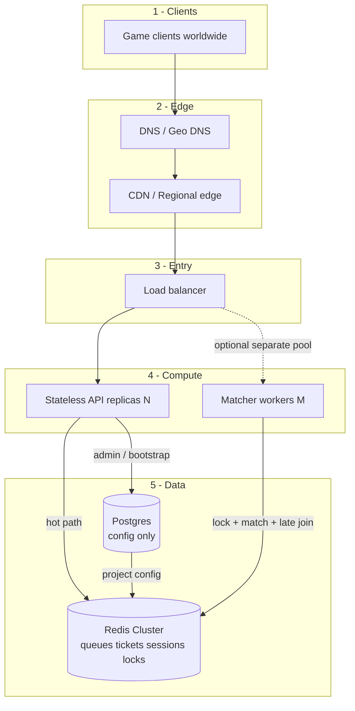
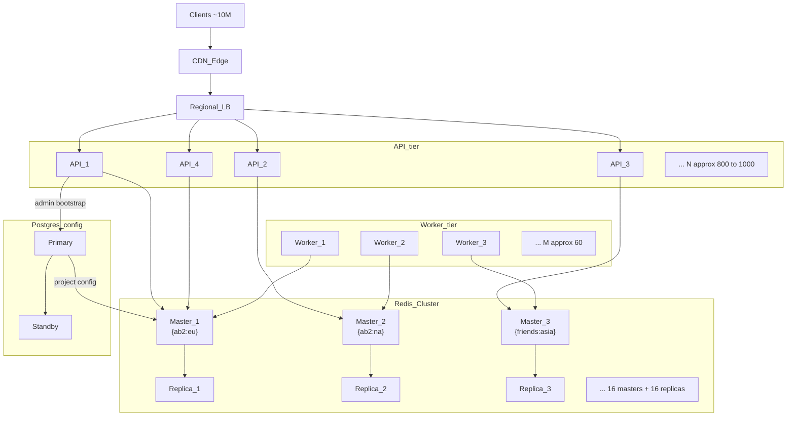
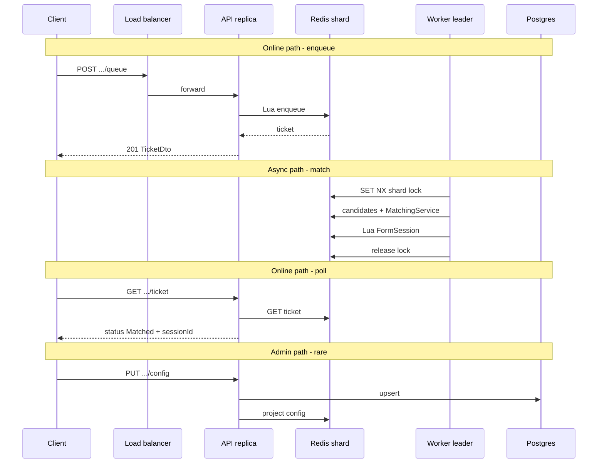

# Scaling Matchmaking to ~10 Million Players

This document describes how **Rovio.Matchmaking** scales toward tens of millions of concurrent players. 

---

## 1. Problem statement

**Goal:** support on the order of **~10M concurrent players** enqueueing, polling, cancelling, and getting matched - without a single global queue or a single machine owning all state.

**Constraints (from this product):**

- Matching is by **latency + wait time**, not skill MMR ladders.
- Hot path must be **fast and multi-region** (`eu`, `na`, `asia`, …).
- Config is **admin-owned** and changes rarely compared to enqueue traffic.
- Multiple **API** and **Worker** replicas must run safely together.

**Core idea:** scale by **partitioning work** (game × region) and by **separating request serving from match formation**.

---

## 2. Back-of-the-envelope estimation

Goal: size **how many** API instances, workers, Redis nodes, load balancers, and Postgres replicas we need before drawing the topology.

### 2.1 Assumptions

| Assumption | Value |
|---|---|
| Concurrent players in the matchmaking funnel | **~10M** (enqueue / wait / poll) |
| Regions | **3** (`eu`, `na`, `asia`) ≈ even split → **~3.3M each** |
| Poll interval | **3s** (dominant read traffic) |
| Average time in queue | **30s** before match or cancel |
| Steady state | Players who leave are replaced; peak concurrent stays ~10M |
| Logical shards | **~10 games × 3 regions ≈ 30** `{gameId:region}` shards |

### 2.2 Traffic math

| Signal | Formula | Global | Per region (~1/3) |
|---|---|---:|---:|
| Poll QPS | `10M / 3s` | **~3.3M** | **~1.1M** |
| Enqueue QPS | `10M / 30s` | **~333K** | **~111K** |
| Cancel QPS | ~10% of enqueue | **~33K** | **~11K** |
| Late-join / config | small vs poll | ignore for sizing | — |
| **Peak API QPS** | poll + enqueue + cancel | **~3.7M** | **~1.2M** |

**Storage (order-of-magnitude):**

- Live ticket/session metadata: ~1–2 KB per player → **~10–20 TB** Redis working set at peak (motivates Cluster + TTL/eviction policy).
- Postgres: **config only** → MB–GB; not sized for ticket QPS.

### 2.3 Capacity assumptions

| Component | Assumed capacity |
|---|---|
| 1 API instance | ~5,000 RPS sustained (Redis-backed HTTP) |
| 1 Redis Cluster master | ~100K ops/s practical share (rough) |
| Worker | scales with **shard leadership**, not poll QPS |
| Postgres | config CRUD only; negligible vs hot path |

### 2.4 Sizing result

| Component | Estimate | Notes |
|---|---|---|
| CDN / regional edge | Global PoPs (managed) | TLS, geo route; not ticket storage |
| Load balancer | **1 active (+ standby) × 3 regions** ≈ **3–6** | Per-region entry |
| API instances | `3.7M / 5K` ≈ **~740** → plan **~800–1000** with headroom | Stateless; scale on RPS |
| Worker instances | **~2× logical shards** ≈ **~60** (30 shards × redundancy) | Lock → one leader per shard |
| Redis Cluster | **~16 masters + 16 replicas** ≈ **32 nodes** | Hash tags `{gameId:region}`; grow if hot shards |
| Postgres | **1 primary + 1 standby** | Config HA only; hot path reads projected config from Redis |

Poll QPS dominates sizing. **WebSocket/push** would cut API count dramatically (see §9 alternatives); this estimate assumes **HTTP poll** as in the current codebase.

---

## 3. High-level architecture 

Layers clients see, from outside in:

```text
┌─────────────────────────────────────────────────────────────────────────┐
│                         CLIENTS  (~10M peak)                            │
│                    Game apps · platforms · regions                      │
└───────────────────────────────┬─────────────────────────────────────────┘
                                │ HTTPS
                                ▼
┌─────────────────────────────────────────────────────────────────────────┐
│                    DNS / CDN / REGIONAL EDGE                            │
│         Route players to a nearby PoP / regional gateway                │
└───────────────────────────────┬─────────────────────────────────────────┘
                                │
                                ▼
┌─────────────────────────────────────────────────────────────────────────┐
│                         LOAD BALANCER                                   │
│              Health checks · TLS terminate · spread RPS                 │
└───────────────┬─────────────────────────────────┬───────────────────────┘
                │                                 │
                ▼                                 ▼
┌───────────────────────────────┐   ┌─────────────────────────────────────┐
│     STATELESS API TIER (N)    │   │      WORKER / MATCHER TIER (M)      │
│  Enqueue · Cancel · Poll      │   │  Poll queues · Form sessions        │
│  Late join · Config CRUD      │   │  Late-join fill · Shard locks       │
└───────────────┬───────────────┘   └──────────────────┬──────────────────┘
                │                                      │
                │         ┌────────────────────────────┘
                │         │
                ▼         ▼
┌─────────────────────────────────────────────────────────────────────────┐
│              REDIS CLUSTER  (hot path / primary runtime store)          │
│   Partitioned by hash tag {gameId:region}: queues, tickets, sessions,   │
│   open-session sets, shard locks · Lua for atomic updates               │
└─────────────────────────────────────────────────────────────────────────┘
                ▲
                │ project / read projected config
┌───────────────┴─────────────────────────────────────────────────────────┐
│              POSTGRES  (durable config only — small write volume)       │
│                    game_match_configs · migrations · admin CRUD         │
└─────────────────────────────────────────────────────────────────────────┘
```



### 3.1 Multi-instance topology (representative)

*Illustrative topology - box count is representative; totals come from the [estimation table](#24-sizing-result).*

We do **not** draw ~800 API boxes. The diagram shows a few instances per tier plus ellipsis labels for fleet size.



**Reading the diagram:**

- **CDN + LB** - one regional entry path per `eu` / `na` / `asia` (3–6 LBs total).
- **API fleet** - stateless replicas behind the LB; any instance can serve any request.
- **Worker fleet** - many processes compete for shard locks; only **one leader** per `{gameId:region}` runs a match pass.
- **Redis Cluster** - masters hold hash-tagged shards; replicas for failover and read scaling where allowed.
- **Postgres** - primary + standby for config durability; runtime hot path reads projected config from Redis.

---

## 4. Component catalog

Each row answers: **what it is**, **why it exists**, **role in this system**, **alternatives**.

### 4.1 Clients (game apps)

| | |
|--|--|
| **What** | Mobile/console/PC game clients calling the HTTP API. |
| **Why** | Players need a simple contract: join queue, poll ticket, cancel, late-join. |
| **Role** | Issue enqueue/poll/cancel/join; retry on `429` / `503` with backoff. |
| **Alternatives** | gRPC or WebSocket push for ticket updates (less polling); still usually fronted by the same API tier. |

### 4.2 DNS / Geo DNS

| | |
|--|--|
| **What** | Name resolution that can prefer a nearby region or failover. |
| **Why** | 10M players are not in one city; latency to the edge matters before matchmaking latency. |
| **Role** | Point `matchmaking.example.com` at a regional entry (or anycast LB). |
| **Alternatives** | Hard-coded regional URLs in the client; service discovery (Consul, etc.) for internal-only traffic. |

### 4.3 CDN / regional edge

| | |
|--|--|
| **What** | Edge PoPs or API gateways close to players (CloudFront, Cloudflare, cloud regional LB, …). |
| **Why** | Absorb TLS, DDoS basics, and geographic routing before hitting core clusters. |
| **Role** | Terminate or forward HTTPS to the regional load balancer; not a place to store match queues. |
| **Alternatives** | Skip CDN and expose regional LBs directly (fine early; weaker global edge protection). |

### 4.4 Load balancer

| | |
|--|--|
| **What** | L7/L4 balancer (ALB, Nginx, Envoy, cloud LB). |
| **Why** | Spread request load across many API instances; remove unhealthy pods. |
| **Role** | Route `/api/v1/...` to the API fleet; health checks against `/health/ready` (or live). |
| **Alternatives** | Client-side round-robin (fragile); DNS-only RR (no health awareness). |

### 4.5 Stateless API tier (scale **N**)

| | |
|--|--|
| **What** | `Rovio.Matchmaking.Api` replicas - ASP.NET Core, no in-process match state. |
| **Why** | Player traffic is **request/response** and must scale with RPS, independently of matching CPU. |
| **Role** | Enqueue, cancel, get ticket, late join, config CRUD; map `Result` → HTTP; bootstrap migrate/seed/project. |
| **Alternatives** | Combine API + matcher in one process (simpler ops, worse scaling); serverless HTTP (cold starts, Redis connection care). |

**Scale rule:** add API pods when enqueue/poll latency or CPU/RPS climbs - **not** when match formation gets slower.

### 4.6 Worker / matcher tier (scale **M**)

| | |
|--|--|
| **What** | `Rovio.Matchmaking.Worker` + `MatchmakingEngine` on a timer. |
| **Why** | Forming sessions is continuous background work; putting it on HTTP threads blocks players and couples scale axes. |
| **Role** | Discover regions, try shard lock, load candidates, run `MatchingService`, form sessions, late-join pass. |
| **Alternatives** | Kafka/SQS consumers per partition; dedicated “match” microservice subscribed to queue events; single-threaded matcher (does not reach 10M). |

**Scale rule:** add workers when match wait times grow or shard count increases - locks ensure only one leader per shard.

### 4.7 Redis Cluster (hot path)

| | |
|--|--|
| **What** | Primary **runtime** store: queues, tickets, sessions, open sets, locks; Lua for atomic multi-key updates within a shard. |
| **Why** | Matchmaking needs low latency + high throughput; Postgres is the wrong tool for millions of ticket ops/sec. |
| **Role** | Source of truth for **live** queue/session state; config **projection** for fast reads. |
| **Alternatives** | MemoryDB / KeyDB; Aerospike; custom in-memory cluster (high ops cost); single Redis (OK early, not 10M multi-region). |

**Sharding pattern:** use hash tags `{gameId:region}` so queue + tickets + lock for one shard land on the **same Cluster slot**.

### 4.8 Distributed shard lock (in Redis)

| | |
|--|--|
| **What** | `SET NX` + TTL lock key per `(gameId, region)`; release with token check. |
| **Why** | Many workers must not form conflicting sessions for the same shard. |
| **Role** | **Leadership only** - who may run a match pass. Correctness of writes still relies on **Lua**. |
| **Alternatives** | Redlock (more nodes, more debate); ZooKeeper/etcd election; Kafka partition ownership; DB advisory locks (wrong store for this hot path). |

### 4.9 Lua scripts (atomic commits)

| | |
|--|--|
| **What** | Server-side Redis scripts for enqueue idempotency, form session, cancel, late join. |
| **Why** | Multi-step Redis updates must be atomic under concurrency (API + workers). |
| **Role** | Prevent torn state (ticket matched but still in queue, etc.). |
| **Alternatives** | Redis transactions (`MULTI/EXEC`) with care; single-key redesign; application-level compare-and-set loops (harder). |

### 4.10 Postgres (durable config)

| | |
|--|--|
| **What** | Relational DB for `game_match_configs` (EF Core migrations). |
| **Why** | Admin config needs durability, queryability, and migrations - not millions of ticket writes. |
| **Role** | Source of truth for **policy**; projected into Redis for runtime. |
| **Alternatives** | DynamoDB/Cosmos for config; etcd/Consul KV; config files in Git (weaker runtime admin UX). |

### 4.11 Config projection (write model → read model)

| | |
|--|--|
| **What** | After Postgres upsert/bootstrap, publish JSON config into Redis (`IGameConfigProjector` → `IGameConfigRuntime`). |
| **Why** | Hot path must not hit Postgres on every enqueue. |
| **Role** | CQRS-lite for config: durable write store, fast read store. |
| **Alternatives** | Cache with TTL in API memory (risky across replicas); sync read from Postgres (won’t scale); change-data-capture stream. |

### 4.12 Health checks & back-pressure

| | |
|--|--|
| **What** | `/health/live`, `/health/ready`; `MaxQueueDepth` → HTTP 429. |
| **Why** | Orchestrators need readiness; overloaded queues need a clear signal. |
| **Role** | LB removes bad nodes; clients backoff on `queue_full` / store down. |
| **Alternatives** | Only CPU autoscaling (too late); silent drops (worse UX). |

---

## 5. Request vs match data paths

**online path** (user waits on HTTP) vs **async path** (system forms matches).



---

## 6. Sharding model (game × region)

**Do not** put 10M players in one Redis list.

| Shard key | Example | Owns |
|-----------|---------|------|
| `{gameId:region}` | `{angry-birds-2:eu}` | Queue ZSET, tickets for that queue, open sessions set, shard lock |

```text
                    ┌──────────────────────────────┐
  angry-birds-2     │  eu   │  na   │  asia │ ...  │
                    ├───────┼───────┼───────┼──────┤
  other-game        │  eu   │  na   │  asia │ ...  │
                    └──────────────────────────────┘
                         each cell = independent shard
```

**Capacity:** global concurrency ≈ sum of activity across shards. A quiet `asia` shard does not block a hot `eu` shard.

**Worker behavior:** try lock → match → unlock; if lock held, skip that shard this tick.

---

## 7. What to scale when

 **API count tracks poll QPS**; **worker count tracks shard leadership**; **Redis node count tracks shard heat and memory**.

| Symptom | Scale this | Why |
|---------|------------|-----|
| High enqueue/poll latency, API CPU/RPS high | API replicas (**N**) | Stateless request tier |
| Players wait too long to match | Workers (**M**) and/or tick interval | More match passes / leaders |
| Redis CPU/memory or hot key | Cluster nodes; more `{game:region}` fan-out | Partition hot path |
| Config admin slow | Postgres size/IOPS (rarely) | Not the 10M bottleneck |
| Queue full `429` | Raise `MaxQueueDepth` **or** add matchers / fix match rate | Back-pressure is intentional |

---

## 8. Failure modes (scale-aware)

| Failure | Behavior in this design |
|---------|-------------------------|
| API instance dies | LB stops routing; in-flight retries hit another replica; enqueue idempotent |
| Worker dies mid-pass | Lock TTL expires; another worker becomes leader |
| Redis node / shard stress | Isolate blast radius to that `{game:region}` if hash-tagged correctly |
| Postgres down | Hot enqueue still works **if** config already projected; admin config APIs fail |
| Projection fails after PG write | `503 config_projection_failed`; heal on API startup re-project |

---

## 9. Alternatives to this overall architecture

| Approach | Pros | Cons vs this design |
|----------|------|---------------------|
| **Monolith API+matcher** | Simple deploy | Cannot scale HTTP and matching independently |
| **Kafka partition per region** | Strong ownership model | More moving parts; overkill if Redis+Lua already atomic |
| **Push (WebSocket) instead of poll** | Lower client RPS | Sticky connections, harder multi-region LB |
| **Single Redis, no Cluster** | Easy locally | Hot keys / memory ceiling at 10M |
| **Match in SQL** | Familiar transactions | Won’t meet ticket throughput |

This service’s bet: **stateless APIs + locked workers + Redis Cluster shards + Postgres config projection** — a standard large-scale matchmaking shape.

---

## 10. Mapping to this repository

| Component box | Code / ops |
|--------------|------------|
| API tier | `src/Rovio.Matchmaking.Api` |
| Worker tier | `src/Rovio.Matchmaking.Worker`, `MatchmakingEngine` |
| Redis adapters / Lua / locks | `Infrastructure/Redis/*` |
| Postgres config | `PostgresGameConfigRepository`, migrations |
| Projection | `RedisGameConfigProjector` / `RedisGameConfigRuntime` |
| Local compose | `docker-compose.yml` (single Redis/Postgres — Cluster is the production scale step) |
