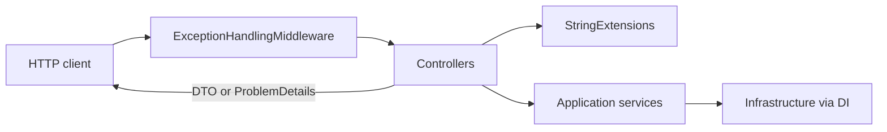

# API Layer

The API is the HTTP edge of matchmaking: it accepts player and admin requests, maps them into Application services, and returns DTOs or Problem Details. It does not run the matching loop — that belongs to the Worker.

**Why it exists:** clients need a stable, versioned REST surface for enqueue, cancel, poll, late join, and config CRUD. Keeping HTTP here (and matching in the Worker) lets API replicas stay thin and scale independently of matcher load.

**Controllers** (`QueueController`, `SessionsController`, `GamesController`) are thin: parse route ids via `StringExtensions`, call application services, map `Result` with `BaseController.HandleError`.  
**`ExceptionHandlingMiddleware`** turns unexpected failures into Problem Details.  
**`MigrationExtensions.ApplyMigrations`** on startup migrates Postgres, seeds default config if needed, and projects configs into Redis.  
**Health:** `/health/live` (process up) and `/health/ready` (Postgres + Redis).

