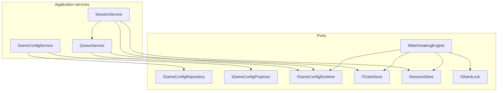

# Application Layer

This layer orchestrates matchmaking use cases: it applies domain rules through application services and talks to the outside world only via ports in `Abstractions`.

**`IGameConfigRepository`** is the durable home for game matchmaking rules so product policy can be stored and updated independently of the live queue.  
**`IGameConfigProjector`** pushes those rules into the runtime view so matchmaking and enqueue see the latest config without reading the durable store on every request.  
**`IGameConfigRuntime`** is the fast read model of config used when deciding whether a game accepts players and how they may be matched.  
**`ITicketStore`** holds player wait requests in the queue-enqueue, lookup, cancel, and candidate windows for matching.  
**`ISessionStore`** persists formed matches: create a session from tickets, read it, list open late-join slots, and attach a late joiner.  
**`IShardLock`** ensures only one matcher works a given game/region at a time so two workers do not form conflicting sessions.  
**`IMatchmakingEngine`** is one matching pass: find compatible queued players, form sessions, and fill open late-join slots under config policy.

**`GameConfigService`** is the admin-facing use case for reading, upserting, seeding, and projecting game rules.  
**`QueueService`** is the player-facing use case for joining, inspecting, and leaving the matchmaking queue.  
**`SessionService`** is the player-facing use case for inspecting a formed match and late-joining an open session.

