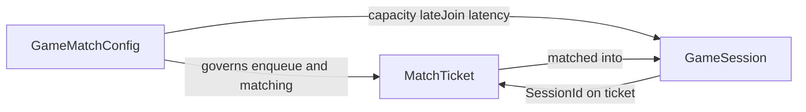

# Domain Layer

This layer is a DDD-inspired model of matchmaking: it owns business meaning and invariants without depending on APIs, Redis, or Postgres.

**DDD Entities** carry identity and lifecycle - `GameMatchConfig` is the game’s matchmaking rules, `MatchTicket` is a player waiting to be matched, and `GameSession` is the match that was formed.

**GameMatchConfig**	How this game is allowed to match : rules of the product (party size, late join, latency policy, enabled, queue depth). One config per game.

**MatchTicket**	A player’s request to be matched : “I want to play this game in this region with this latency.” Lives in the queue until matched or cancelled.

**GameSession**	The match that was formed : the group of players who will play together (and maybe still accept late joiners).

**DDD Value objects** (`GameId`, `PlayerId`, `MatchRegion`, `Latency`, `LatencyPolicy`, `PlayerCapacity`, and related types) are validated, immutable concepts without their own identity, so invalid data never enters the model as raw strings or numbers.

**`MatchingService` (DDD Domain Service)** is the most important domain service in this layer: it owns *who gets matched with whom*. Selecting a compatible ticket group spans many tickets plus config policy (capacity, latency tolerance vs wait time), so that decision does not belong on a single entity.

**`MatchingService` Responsibility:** given queued candidates for **one** game and region (a single shard), `SelectMatchGroup` picks one fair lobby --> oldest-first, pairwise latency-compatible under the stricter of each player’s wait-expanded tolerance, within min/max party size - or returns an empty list when no group can start. It also rejects invalid input and corrupted queue data (cross-shard tickets, duplicate players) via the Result pattern. The worker/engine loads candidates and forms sessions; this service decides the match itself.

Config governs enqueue and matching; queued tickets are grouped into a session; a session may later accept late-join tickets when capacity and policy allow.

