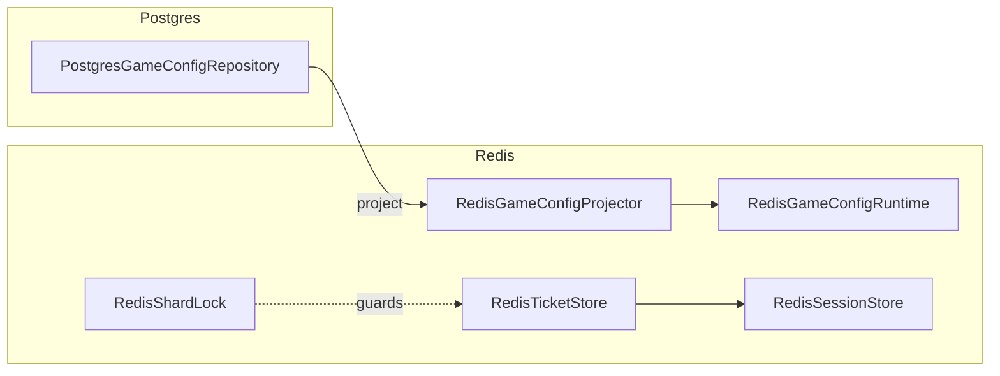

# Infrastructure Layer

This layer implements Application ports with concrete stores and the worker matching engine so use cases can run against real systems.

**Postgres** is the durable source of truth for game matchmaking configuration (`MatchmakingDbContext`, migrations, `PostgresGameConfigRepository`).  
**Redis** is the hot-path runtime for projected config, queues, tickets, sessions, and shard locks used by the API and matchmaking worker.

**`RedisKeys`** centralizes Redis key formats for config, tickets, queues, players, open sessions, and locks.  
**`GameMatchConfigProjection`** is the JSON DTO written to and read from Redis for a game’s runtime matchmaking rules.  
**`RedisGameConfigProjector`** publishes Postgres-backed configs into Redis (and the config index) after save or bootstrap.  
**`RedisGameConfigRuntime`** reads that projected config and lists known game ids for enqueue and matching.  
**`RedisTicketStore`** enqueues, loads, cancels, and lists queued match tickets.  
**`RedisSessionStore`** forms sessions from tickets, loads them, lists open late-join sessions, and attaches late joiners.  
**`RedisShardLock`** takes a short-lived lock per game/region so only one matcher owns that shard at a time.

