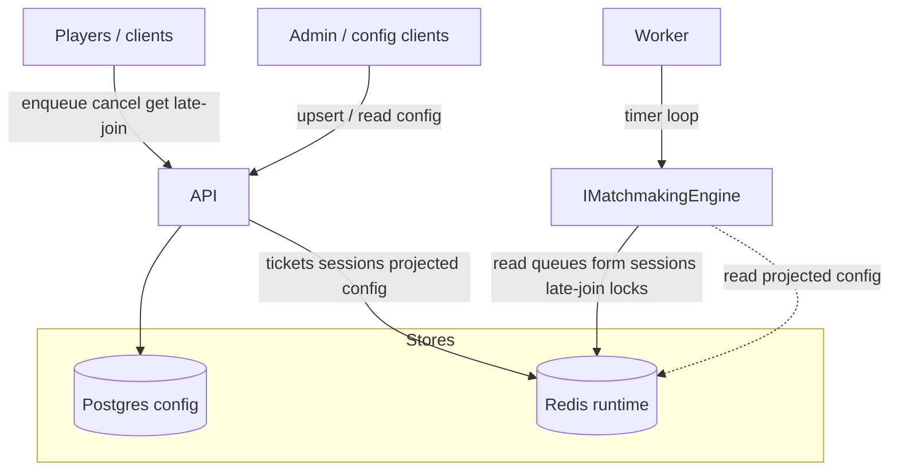

# Worker Layer

The Worker is a background host that continuously runs matchmaking passes. It does not serve player or admin HTTP; it only drives `IMatchmakingEngine` on a timer so queued tickets become sessions without waiting on an API request.

**Why it exists:** enqueue, cancel, ticket lookup, and late-join are request/response (API). Forming matches is asynchronous work-scan queues, pick compatible groups, form sessions, fill late-join slots-and must keep running even when no one is calling the API. Putting that loop in the Worker keeps the API fast and lets you scale matchers separately (multiple workers coordinate via Redis shard locks).

**`MatchmakingWorker`** is a `BackgroundService`: each tick opens a DI scope, runs `IMatchmakingEngine.RunOnceAsync`, then delays by `Matchmaking:WorkerIntervalMs`.

